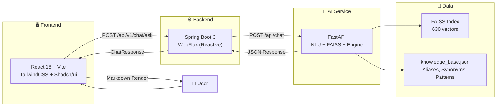
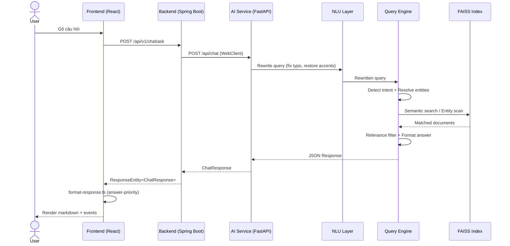
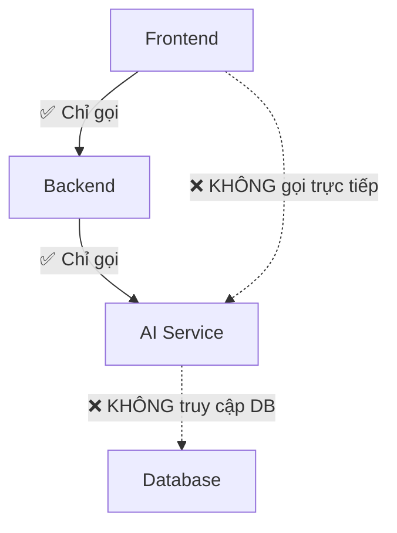

# 🏛 HistoryMind AI

**Trợ lý lịch sử Việt Nam thông minh** — hệ thống chatbot sử dụng AI để tra cứu và trả lời câu hỏi về lịch sử Việt Nam.

[](https://historymindai.vercel.app)
[](https://behistorymindai-production.up.railway.app)
[](http://localhost:8000)

---

## 🏗 Kiến trúc Tổng thể



---

## 🔄 Luồng Xử lý



---

## 📦 Cấu trúc Repository

Đây là **monorepo orchestrator** sử dụng **git submodules**:

```
HistoryMindAI/
├── FE_HistoryMind_AI/          # 🖥 Frontend (git submodule)
│   └── React 18 + TypeScript + Vite + TailwindCSS
│
├── BE_HistoryMind_AI/          # ⚙️ Backend (git submodule)
│   └── Spring Boot 3 + WebFlux + WebClient
│
├── vietnam_history_dataset/    # 🤖 AI Service + Data (git submodule)
│   ├── ai-service/             # FastAPI application
│   │   ├── app/                # Core: engine, NLU, search
│   │   ├── scripts/            # Data pipeline
│   │   ├── faiss_index/        # Vector index
│   │   └── knowledge_base.json # Knowledge base
│   └── tests/                  # 408 unit tests
│
├── contracts/                  # 📋 API & Data contracts
├── architecture/               # 📐 System design docs
└── README.md                   # ← Bạn đang đọc file này
```

---

## 🚀 Quickstart

### 1. Clone với submodules

```bash
git clone --recurse-submodules https://github.com/HistoryMindAI/HistoryMindAI.git
cd HistoryMindAI
```

### 2. Khởi chạy AI Service (port 8000)

```bash
cd vietnam_history_dataset/ai-service

# Option A: Docker (khuyến nghị)
docker build -t vietnam-history-ai .
docker run -d -p 8000:8000 --name ai-service-container vietnam-history-ai

# Option B: Local
pip install -r requirements.txt
uvicorn app.main:app --reload
```

### 3. Khởi chạy Backend (port 8080)

```bash
cd BE_HistoryMind_AI
./mvnw spring-boot:run
```

### 4. Khởi chạy Frontend (port 3000)

```bash
cd FE_HistoryMind_AI
npm install
echo "VITE_API_URL=" > .env.local
npm run dev
```

→ Mở `http://localhost:3000` và bắt đầu hỏi!

---

## 🧠 Tính năng AI

| Tính năng | Mô tả |
|-----------|-------|
| **NLU** | Sửa lỗi chính tả, phục hồi dấu, fuzzy matching, phonetic normalization |
| **Entity Resolution** | Nhận diện nhân vật, triều đại, chủ đề, địa danh (exact + fuzzy) |
| **Same-Entity Detection** | "Quang Trung và Nguyễn Huệ là ai?" → "Cùng một người" |
| **Semantic Search** | FAISS vector search với vietnamese-sbert |
| **Relevance Filter** | Relative scoring loại events không liên quan |
| **Fallback Chain** | 3 chiến lược retry khi không tìm được kết quả |
| **Data-Driven** | Thêm alias/synonym → sửa JSON, không sửa code |

---

## 📐 Quy tắc Giao tiếp



| Quy tắc | Mô tả |
|---------|-------|
| FE → BE only | Frontend không gọi AI trực tiếp |
| BE → AI only | Backend là cầu nối duy nhất |
| AI = Stateless | AI Service không lưu state, không truy cập DB |
| Contracts are authoritative | DTOs trong `contracts/` là nguồn chân lý |

---

## 🧪 Testing

| Service | Framework | Tests | Lệnh |
|---------|-----------|-------|------|
| AI Service | pytest | 408 | `cd vietnam_history_dataset/ai-service && python -m pytest ../tests/` |
| Frontend | Vitest | 13 | `cd FE_HistoryMind_AI && npm test` |
| Backend | JUnit | — | `cd BE_HistoryMind_AI && ./mvnw test` |

---

## 🌐 Deployment

| Service | Platform | URL |
|---------|----------|-----|
| Frontend | Vercel | https://historymindai.vercel.app |
| Backend | Railway | https://behistorymindai-production.up.railway.app |
| AI Service | Docker (self-hosted) | http://localhost:8000 |

---

## 📚 Tech Stack

| Layer | Công nghệ |
|-------|-----------|
| Frontend | React 18, TypeScript, Vite 7, TailwindCSS, Framer Motion |
| Backend | Spring Boot 3, WebFlux, WebClient, Java 17 |
| AI Service | FastAPI, FAISS, sentence-transformers, Python 3.11+ |
| AI Model | `keepitreal/vietnamese-sbert` (ONNX) |
| Data Source | HuggingFace: Vietnam-History-1M-Vi |
| Infrastructure | Vercel, Railway, Docker |

---

_Được phát triển nhằm gìn giữ và truyền bá kiến thức lịch sử Việt Nam thông qua công nghệ AI hiện đại. 🇻🇳_
